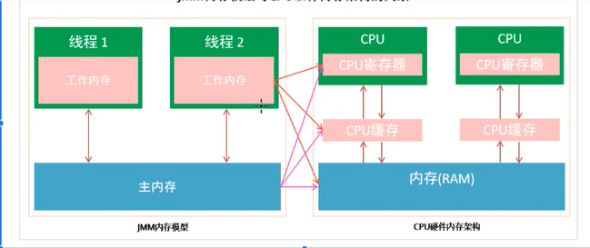
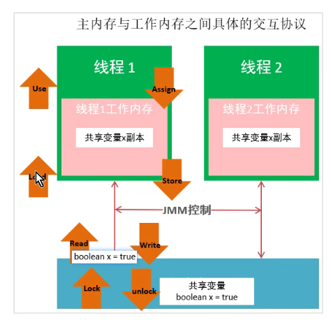
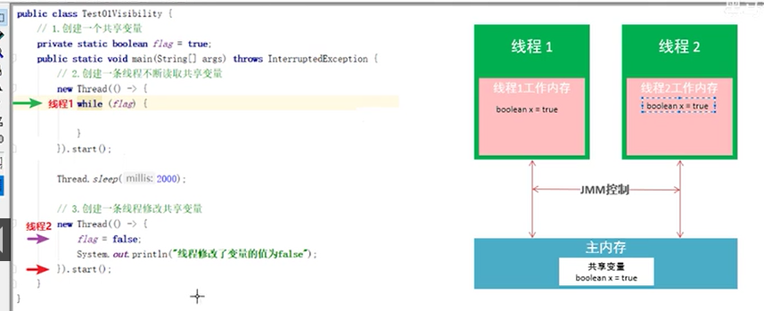
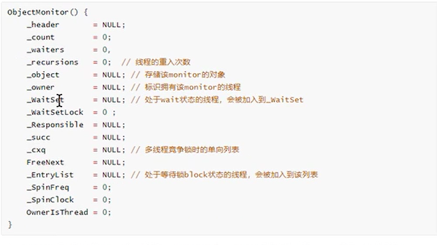

# 前置知识
# 第一章 并发编程中的三个问题

- 可见性
  - 一个线程对一个变量进行修改，另一个线程能立即得到这个变量修改后的最新值
  - 并发编程时，会出现可见性问题：即当一个线程修改了共享变量的值，其他线程可能不会立即得到该变量的最新值
- 原子性
  - 在一次或多次操作中，要么所有的操作都执行并且不会受其他因素的干扰而中断，要么所有的操作都不执行。
- 有序性
  - 程序代码在执行过程中的先后顺序，由于Java虚拟机在编译期及运行期的优化，导致代码的执行顺序并不一定就是开发者编写代码时的顺序。

# 第二章 Java内存模型

## 计算机结构

### 目标

	- 学习计算机主要组成部分
	- 学习缓存的作用

### 计算机结构简介

冯诺依曼：提出计算机5大部分组成：输入设备、输出设备、存储器、控制器、运算器

### CPU

### 内存

​	内存读写速度与CPU运算速度之间的差距成为计算机性能瓶颈，为了解决这个问题，设计了缓存

### 缓存

缓存内置于CPU中

L1 最靠近CPU的缓存，容量最小，速度最快，每个CPU内核上都有一个L1缓存

L2级缓存，速度比L1慢些，一般情况下每个核心上都有一个L2缓存

L3级缓存，是三级缓存中最大的一级，同时也是缓存中最慢的一级，在同一个CPU插槽之间的CPU核心共享一个L3缓存

### 磁盘

### 输入输出设备

## Java内存模型

### 目标

学习Java内存模型的概念和作用

### Java内存模型的概念

Java Memory Model (JMM)

- 主内存（共享内存）
  - 所有线程共享的内存
- 工作内存
  - 线程私有的内存

### Java内存模型的作用

Java内存模型是一套在多线程读写共享数据时，对共享数据的可见性、有序性和原子性的规则和保障。

synchronized 

volatile

### java内存模型和CPU硬件内存架构的关系



### 主内存与工作内存之间的交互



- 如果执行lock操作，则会清空线程工作内存中此变量的值
- 对一个变量执行unlock操作之前，一定会先把此变量同步到主内存中

### 总结

在JMM中，通过以下8个原子操作来保证主内存和工作内存之间的数据交互：

lock->read->load->use->assign->store->write->unlock

# 第三章 synchronized保证三大特性

synchronized能保证同一时刻只有一个线程执行该段代码，以达到保证并发安全的效果

``` Java
synchronized(锁对象){
	//受保护资源
}
```

## 1、synchronized保证原子性

``` Java

```
synchronized保证原子性的原理：
对代码块使用synchronized修饰后，保证同一时间只有一个线程能执行该代码块，从而不会出现线程安全问题。
## 2、synchronized保证可见性

一个线程修改了共享变量之后，其他的线程并不知道，依然使用的是之前从主内存拷贝到自己工作内存的值.
执行synchronized代码块时，对应jvm的lock原子操作，会刷新工作内存中的共享变量的值为主内存中最新的值。
## 3、synchronized保证有序性

#### synchronized是如何保证有序性的呢？

synchronized修饰代码块，不会阻止编译器和处理第对代码块内的代码进行重排序，但是能保证只有一个线程执行同步代码块中的代码，从而保证有序性。

# 第四章 synchronized的特性

## synchronized的可重入特性

什么是可重入？

一个线程可以多次执行synchronized代码块，重复获取同一把锁。

了解synchronized可重入的原理。

synchronized的锁对象中有一个计数器(recursions变量)，会记录线程获得锁的次数。

### 可重入的好处

- 避免死锁
- 可以让我们更好的来封装代码

## 小结

synchronized是可重入锁，内部锁对象中有一个计数器来记录线程获取所得次数，进入同步代码块时，内部锁对象的计数器+1；在执行完同步代码块时，计数器-1，知道计数器的数量为0，则释放锁

## synchronized的不可中断特性

- 学习synchronized不可中断特性
- 学习Lock的可中断特性

**什么是不可中断性？**

一个线程获得锁后，另一个线程想要获得锁，必须处于阻塞或等待状态，一个线程不释放锁，第二个线程会一直阻塞或等待，不可中断一直等待。

## 小结

不可中断是指：当一个线程获得锁，另一个线程一直处于阻塞或等待状态，前一个线程不释放锁，后一个线程会一直阻塞或等待，不可被中断

synchronized属于不可中断锁

Lock.lock()属于不可中断锁

Lock.tryLock()属于可终端的锁

# 第五章 synchronized原理

## 使用javap反汇编学习synchronized原理

javap -p -v  .class文件

monitorenter指令和monitorexit指令

## 同步代码块

### monitorenter

synchronized的锁对象会关联一个monitor对象，这个对象不是我们主动创建的，而是JVM线程执行到这个代码块时发现锁对象没有monitor对象，就会创建一个C++对象。monitor对象有两个重要的成员变量：

- owner：拥有这把锁的线程
- recursions：记录线程拥有锁的次数，当一个线程拥有monitor后，其他线程只能等待

### monitorexit

- 能执行monitor指令的线程一定是拥有当前对象的锁的线程
- 当执行monitorexit指令时，会把recursions做-1操作，当recursions为0时，则会释放这把锁

### synchronized出现异常会释放锁吗？

**会**

## 同步方法

**ACC_SYNCHRONIZED synchronized修饰的实例方法，会被JVM用ACC_SYNCHRONIZED修饰，隐式地调用monitorenter和monitorexit，在执行同步方法前会执行monitorenter，在执行同步方法后会执行monitorexit指令**

## synchronized和Lock的区别

- synchronized是关键字，Lock是接口
- synchronized自动释放锁，Lock必须手动释放锁
- synchronized不可中断，Lock可中断也可不中断
- synchronized能锁代码块和方法，Lock只能锁代码块
- synchronized不能知道线程有没有拿到锁，Lock可以
- Lock可以使用读锁提高多线程读写效率
- synchronized是非公平锁，Lock可以控制是否公平

## 深入JVM源码

### monitor监视器锁




# 浅析synchronized关键字
## 修饰实例方法
## 修饰静态方法
## 修饰代码块
# synchronized关键字的使用
# synchronized关键字底层原理
# 锁的升级流程
# synchronized关键字修饰方法的底层原理